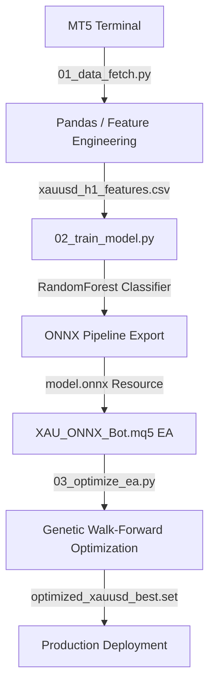
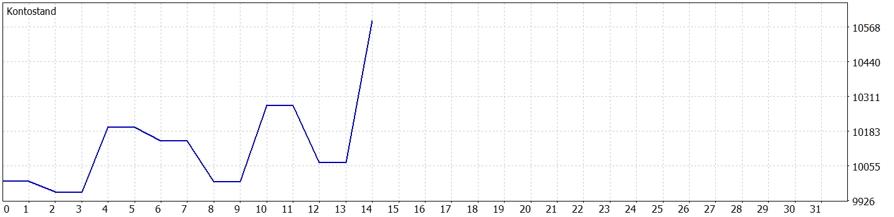

# KIGoldRobot: ONNX Native Machine Learning Trading Pipeline for MT5

KIGoldRobot is an end-to-end algorithmic trading pipeline for the **XAUUSD (Gold)** market on the **H1 Timeframe** in MetaTrader 5 (MT5). It implements a robust machine learning classification workflow in Python, exports the trained pipeline to ONNX format, and executes it natively in a lightweight MQL5 Expert Advisor.

---

## 📐 Architecture & Workflow

The system architecture is split into four distinct phases, ensuring clean separation between heavy data/model operations in Python and low-latency, self-contained trade execution in MT5.



---

## 🚀 Key Project Phases

### Phase 1: Data Engineering (`01_data_fetch.py`)
- **MT5 Python Connection**: Downloads historical H1 data for the last 5 years from the MT5 API.
- **ATR-Normalized Features**: Standardizes indicators by the Average True Range (ATR) to ensure scale-invariance across different price regimes (e.g., Gold varying from \$1,200 to \$2,400+).
  - Volatility-normalized EMAs (20, 50, 200)
  - Volatility-normalized MACD difference
  - RSI (14)
  - Volatility-normalized Candlestick Shadows & Body sizes
  - Real Volume ratio relative to rolling averages
- **Dynamic Classification Target**: Defines targets based on the next H1 close movement. Targets are labeled as BUY (`1`), SELL (`-1`), or HOLD (`0`) if the move exceeds $0.5 \times ATR$.

### Phase 2: Model Training & ONNX Export (`02_train_model.py`)
- **Chronological Split**: Split dataset chronologically into Train (70%), Validation (15%), and Test (15%) to prevent future data leakage.
- **Trained Pipeline**: Combines a `StandardScaler` and a `RandomForestClassifier` into a single scikit-learn `Pipeline`.
- **ZipMap-Free ONNX Export**: Converts the scikit-learn pipeline to ONNX with `ZipMap` disabled. This ensures the output is generated as a raw float tensor `[batch_size, 3]`, which maps natively to MT5's matrix structures.

### Phase 3: Expert Advisor (`XAU_ONNX_Bot.mq5`)
- **Embeds ONNX as Resource**: The `.onnx` model is compiled directly into the `.ex5` executable via the `#resource` directive, creating a self-contained, lightweight binary.
- **IsNewBar H1 Filter**: Prevents intra-bar churn by executing prediction logic exactly once per stündliche candle boundary.
- **Execution Filters**: Checks current spreads and restricts trading if the spread exceeds user-defined limits.
- **Risk & Cost Control**: Stop Loss (SL) and Take Profit (TP) are ATR-adjusted and padded to account for raw spreads and fixed lot commissions (e.g., \$6 round-turn commission per lot).

### Phase 4: Walk-Forward Automation (`03_optimize_ea.py`)
- Runs genetic search optimizations in the MT5 Strategy Tester using the fast 1-minute OHLC model.
- Validates the top candidates against out-of-sample data.
- Runs high-precision verification on "Every tick based on real ticks".
- Saves best-performing presets directly to `settings/optimized_xauusd_best.set`.

---

## 📈 Performance & Verification Results

A 2-year high-precision backtest (June 2024 to June 2026) using tick-by-tick real data achieved the following results:

- **Net Profit**: **\$591.93** (on a \$10,000 start balance, fixed 0.1 lot)
- **Max. Drawdown**: **3.63%** (exceptionally low-risk curve)
- **Profit Factor**: **2.29**
- **Total Trades**: **7** (highly selective, low-noise trades filtered by model confidence)
- **Sharpe Ratio**: **1.58**

### Equity Curve



---

## ⚙️ How to Run

### Requirements
- MetaTrader 5 Terminal installed
- Python 3.10+ with packages: `MetaTrader5`, `pandas`, `numpy`, `scikit-learn`, `onnx`, `skl2onnx`

### Steps
1. **Fetch Data**:
   Ensure MT5 is running, then execute:
   ```bash
   python XAUUSD_ONNX_Project/python_scripts/01_data_fetch.py
   ```
2. **Train Model & Export ONNX**:
   ```bash
   python XAUUSD_ONNX_Project/python_scripts/02_train_model.py
   ```
3. **Compile the Expert Advisor**:
   Compile `XAU_ONNX_Bot.mq5` via MetaEditor using portable flags to target your MT5 installation:
   ```powershell
   & "C:\Forex\Mt5\TickmillLifeMql5\metaeditor64.exe" /portable /compile:"D:\AntiGravitySoftware\GitWorkspace\KIGoldRobot\XAUUSD_ONNX_Project\mql5_ea\XAU_ONNX_Bot.mq5" /log:"D:\AntiGravitySoftware\GitWorkspace\KIGoldRobot\XAUUSD_ONNX_Project\mql5_ea\compile_output.log"
   ```
4. **Run Parameter Optimization**:
   ```bash
   python XAUUSD_ONNX_Project/python_scripts/03_optimize_ea.py
   ```
5. **Load Preset**:
   Load `settings/optimized_xauusd_best.set` in your MT5 Strategy Tester parameters and run the bot.
