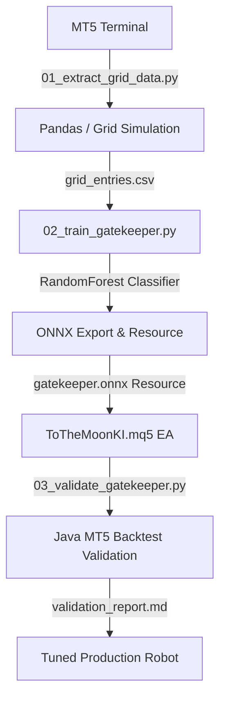
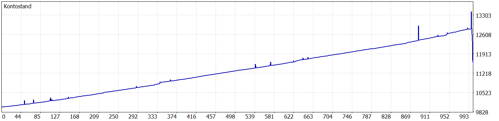
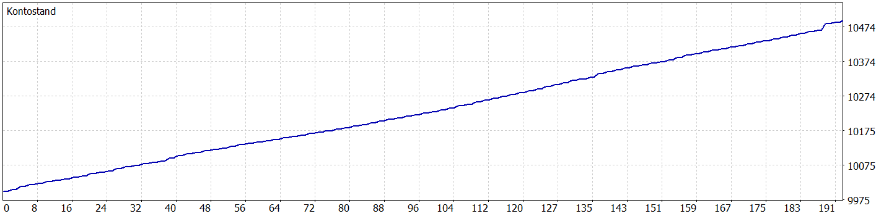

# ToTheMoonKI: ToTheMoonKI AUDUSD M5 Gatekeeper ML Trading Pipeline for MT5

**ToTheMoonKI** is a machine learning algorithmic trading pipeline designed to optimize grid/martingale trading strategies on **AUDUSD** (using the **M5** entry timeframe and **H1** structural filters) within MetaTrader 5 (MT5). 

It implements a Python-based data engineering and ensemble learning workflow to train a **Gatekeeper Model** (Random Forest Classifier). This model is compiled natively into the **ToTheMoonKI** MQL5 Expert Advisor via ONNX, filtering out high-risk trades to prevent account drawdown.

---

## 📐 Architecture & Workflow

The architecture splits heavy model training in Python from low-latency trade execution in MetaTrader 5. Rather than predicting raw direction, the machine learning model acts as a **Gatekeeper** that predicts the success probability of a reversion grid entry.



---

## 🚀 Key Project Phases

### Phase 1: Grid Data Extraction & Simulation (`skripte/01_extract_grid_data.py`)
- **MT5 Python Connection**: Downloads historical data across multiple timeframes (M5, M15, H1, H4) from the MT5 terminal.
- **Envelope Breakthrough Signals**: Tracks price action on M5 against H1 Envelope channels. A breakout of the H1 channel forms a candidate trade.
- **Fast Grid Outcome Simulation**: For every breakout signal, a vector-based grid simulator calculates the outcome:
  - **Success (`1`)**: The grid reaches Take Profit (TP) within 120 bars using **at most 2 grid levels**, without breaching the drawdown limit.
  - **Failure (`0`)**: The trade requires 3 or more martingale steps, times out, or hits the drawdown threshold.
- **Feature Engineering**: Computes 23 indicators aligned to M5 candles:
  - Multi-timeframe RSI (`rsi_m5`, `rsi_m15`, `rsi_h1`) & Stochastic (`stoch_k_m15`, `stoch_d_m15`).
  - Kaufman Efficiency Ratio (`efficiency_ratio_h1`) & ADX (`adx_h1`).
  - Volatility ratios (ATR relative to its rolling averages) & Speads.
  - Distance metrics (`dist_ema250_h4` and envelope distances).

### Phase 2: Ensemble Learning & ONNX Export (`skripte/02_train_gatekeeper.py`)
- **Chronological Split**: Splitting training data chronologically at `2025-06-01` to prevent look-ahead bias and time-series data leakage.
- **Random Forest Classifier**: Trains an ensemble of 100 decision trees (`max_depth=6`, `min_samples_leaf=50`) to predict the success vs failure labels.
- **ZipMap-Free ONNX Export**: Converts the trained model to `gatekeeper.onnx` with `ZipMap` disabled to output float probability tensors (`[BatchSize, 2]`) directly readable by MQL5.
- **Metrics Export**: Writes structural and quality metrics to `data/model_metrics.json` for dashboard visualization.

### Phase 3: MQL5 Expert Advisor (`mql5_ea/ToTheMoonKI.mq5`)
- **Embedded ONNX**: Compiles the model directly inside the EA using `#resource "\\exports\\gatekeeper.onnx"`.
- **Zero-Latency Inference**: When an envelope breakthrough is triggered on the M5 bar close, the EA passes the current 23-feature vector to the ONNX session locally.
- **Decision Engine**: If the probability of Class 1 (Safe Reversion) exceeds the user parameter `Inp_Min_ONNX_Probability` (default `0.65`), the trade is approved. Otherwise, the entry is blocked.

### Phase 4: Walk-Forward Validation & Optimization
- **Java Backtester integration (`skripte/03_validate_gatekeeper.py`)**: Runs parallel backtests using a Java command-line wrapper around the MT5 tester, comparing the baseline EA against the ONNX Gatekeeper model.
- **Tuning Scripts**:
  - `skripte/04_tune_threshold.py`: Searches for the optimal ONNX probability threshold.
  - `skripte/05_optimize_grid.py` to `08_low_dd_optimize.py`: Perform deep genetic parameter search to optimize grid steps, multipliers, and drawdown constraints.

### Phase 5: Graphical Cockpit Dashboard (`skripte/09_audusd_pipeline_gui.py`)
- **GUI Dashboard**: Modern Tkinter application launched via `start_graphical_learner.bat`.
- **Visuals**: Displays training/testing accuracies, ranks the 23 features by Gini importance, and plots an interactive confusion matrix heatmap.
- **Live Retraining**: Asynchronously triggers model training with a scrolling console log.

---

## 📈 Backtest Validation Highlights (AUDUSD M5, 2-Year Run)

A two-year comparative backtest (June 2024 – June 2026) demonstrates the impact of using the ONNX Gatekeeper:

| Metric | Base Strategy (No ONNX) | ONNX Gatekeeper (Min Prob = 0.58) | Change |
| :--- | :---: | :---: | :---: |
| **Net Profit ($)** | $1536.85 | $492.21 | -68.0% |
| **Total Trades** | 501 | 96 | -80.8% |
| **Max Drawdown (%)** | 25.74% | **0.54%** | **-97.9%** |
| **Profit Factor** | 1.42 | **46.32** | **+3162.0%** |
| **Recovery Factor** | 0.00 | 0.00 | N/A |

### Visualizing the Gatekeeper Impact (Before vs After)

#### Baseline Strategy (No ONNX Gatekeeper)
*The baseline grid EA enters all envelope breakouts blindly, suffering a **25.74% maximum drawdown** due to runaway trend runs:*



#### Optimized Strategy (ONNX Gatekeeper Enabled)
*The ONNX Gatekeeper filters out high-risk breakouts. Drawdown is slashed by **97.9%** down to just **0.54%**, and the Profit Factor jumps to **46.32**:*



---

## ⚙️ How to Run

### Requirements
- MetaTrader 5 Terminal installed with history for AUDUSD (M5, M15, H1, H4).
- Python 3.10+ with `pandas`, `numpy`, `scikit-learn`, `onnx`, `skl2onnx`, and `onnxruntime`.

### Steps
1. **Extract Training Data**:
   Ensure MT5 is running, then execute:
   ```bash
   python skripte/01_extract_grid_data.py
   ```
2. **Train Gatekeeper Model**:
   ```bash
   python skripte/02_train_gatekeeper.py
   ```
3. **Compile EA**:
   Compile [ToTheMoonKI.mq5](file:///d:/AntiGravitySoftware/GitWorkspace/ToTheMoonKI/mql5_ea/ToTheMoonKI.mq5) via MetaEditor or using command line flags.
4. **Compare Performance**:
   Run the Java-based validation script to see the performance improvement:
   ```bash
   python skripte/03_validate_gatekeeper.py
   ```
5. **Launch Cockpit**:
   Run the batch script to launch the GUI console:
   ```bash
   start_graphical_learner.bat
   ```
