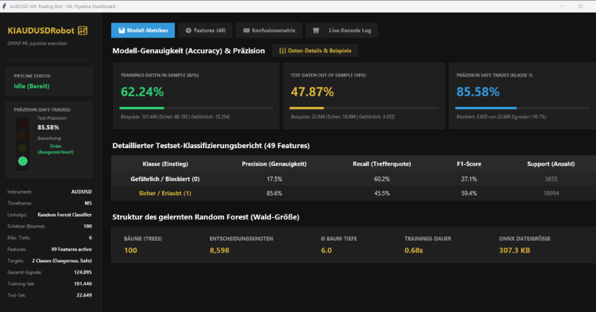
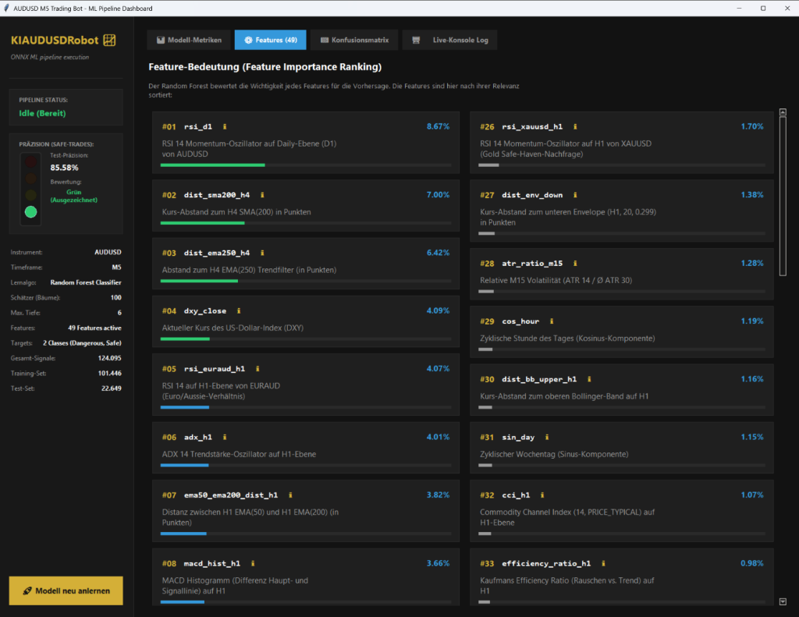

# ToTheMoonKI: ToTheMoonKI AUDUSD M5 Gatekeeper brief & AI Marketing Blueprint

This documentation serves as a structured project brief detailing the **ToTheMoonKI** machine learning trading pipeline. It is optimized to be read by humans and easily parsed by other AI agents to write blog posts, landing page copies, or promotional content for the **KI-Software-Schmiede** homepage.

---

## 🔗 Repository & Project Identity
*   **Project Name:** ToTheMoonKI (ToTheMoonKI AUDUSD Gatekeeper System)
*   **GitHub Repository:** [https://github.com/tnickel/ToTheMoonKI](https://github.com/tnickel/ToTheMoonKI)
*   **Target Market:** AUDUSD, M5 Timeframe (Entries) with H1 Envelope Channels (Structure)
*   **Architecture Pattern:** Python Machine Learning Pipeline + Native ONNX MetaTrader 5 Expert Advisor

---

## 🛠️ Technological Stack

| Layer | Technology | Key Purpose |
| :--- | :--- | :--- |
| **Data Extraction** | Python 3.12, `MetaTrader5` Package | Connection to MT5 terminal database to download multi-timeframe price history (M5, M15, H1, H4). |
| **Data Processing** | Python `pandas`, `numpy` | Feature engineering, time encodings, indicator alignment, and vector-based grid trading outcome simulation. |
| **Machine Learning** | Python `scikit-learn` | RandomForestClassifier trained with chronological validation to classify high-risk vs. safe grid entry points. |
| **Model Serialization**| Python `skl2onnx`, `onnx` | Converts the trained Random Forest model into a single, optimized `.onnx` graph (ZipMap disabled). |
| **Inference & Strategy**| MQL5 (Strict Mode) | Custom Expert Advisor (`ToTheMoonKI.mq5`) that compiles the model natively as a resource for zero-latency local execution. |
| **Backtest Automation** | Java SE, CLI wrapper, MT5 Tester | Auto-configures and runs backtest validation and genetic optimization runs on historical data. |
| **Pipeline UI** | Python `tkinter`, `ttk` | Modern Tkinter dashboard (`09_audusd_pipeline_gui.py`) visualizing model performance, feature importances, and live training console. |

---

## 📐 Development Methodology & Step-by-Step Execution

### Phase 1: M5 Entry & H1 Envelope Channels
*   **The Reversion Signal:** Candidate entry signals are triggered on the M5 timeframe when the close of the previous candle breaks outside of the H1 Envelope channels (upper envelope for SELL, lower envelope for BUY).
*   **Grid Reversion Strategy:** Once triggered, the bot utilizes a martingale-like grid (up to 3 levels: lot sizes 1.0, 1.38, 1.38^2) to close the basket in profit.

### Phase 2: Python-Driven Grid Simulation & Labeling
*   **Why filtering is necessary:** During strong trends, breakouts can keep moving against the position, causing the grid to overextend, requiring deep drawdown or hitting the account stop-out.
*   **Outcome Simulation:** For each potential envelope breakout, a simulator checks the outcome over the next 120 bars:
  - **Class 1 (Safe/Success):** Reaches Take Profit using $\le 2$ grid steps, without hitting the drawdown limit (300 points).
  - **Class 0 (Dangerous/Failure):** Requires 3 or more grid levels, times out, or hits the drawdown threshold.
*   **The Target:** The model learns a binary target (Class 1 vs Class 0) to classify whether the market conditions at breakout represent a safe entry or a dangerous overextension threat.

### Phase 3: Ensemble Learning & Chronological Validation
*   **Time-Series Validation:** Data is split chronologically at `2025-06-01` into Train and Test sets. This prevents future data leakage and ensures robustness against regime changes.
*   **Precision Focus:** We train a `RandomForestClassifier` with balanced class weights to maximize precision on Class 1 (reducing false signals).

### Phase 4: Zero-Latency ONNX Native Integration
*   **Native Resource:** The `.onnx` gatekeeper model is compiled directly into the MT5 EA binary via the `#resource` compiler directive.
*   **Sandbox Inference:** The EA calculates the 23-feature vector on every new M5 bar and calls the local ONNX session. If the Class 1 probability exceeds the threshold parameter (e.g. `0.65`), the trade is approved. Otherwise, it is blocked.
*   **ZipMap Pruning:** Disabling ZipMap allows exporting output probabilities as a clean float matrix `[BatchSize, 2]` which is fully compatible with MT5's matrix structures.

### Phase 5: Graphical Cockpit Dashboard (`skripte/09_audusd_pipeline_gui.py`)
*   **GUI Cockpit**: Modern Tkinter application launched via `start_graphical_learner.bat`.
*   **Visuals**: Displays training/testing accuracies, ranks the 49 features by Gini importance, and plots an interactive confusion matrix heatmap.
*   **Live Retraining**: Asynchronously triggers model training with a scrolling console log.

#### Dashboard Interface (Metrics & Accuracy)
*Renders real-time model statistics, training progress, classification reports for Class 1 (Safe trades) and Class 0 (Dangerous/blocked trades), and forest details:*

#### Feature Importance Ranking
*Displays Gini importances of all 49 active features, indicating that momentum (rsi_d1) and structural distances (dist_sma200_h4, dist_ema250_h4) carry the highest predictive weight:*

---

## 📈 Performance Highlights (AUDUSD M5, OOS 2026 Test)

The integration of the ONNX Gatekeeper provides a massive improvement in risk-adjusted performance by filtering out high-risk reversion entries:

| Metric | Base Strategy (No ONNX) | ONNX Gatekeeper (Min Prob = 0.58) | Change |
| :--- | :---: | :---: | :---: |
| **Net Profit ($)** | $18987.05 | $3419.82 | -82.0% |
| **Total Trades** | 145 | 30 | -79.3% |
| **Max Drawdown (%)** | 35.92% | **9.79%** | **-72.7%** |
| **Profit Factor** | 2.35 | **45.54** | **+1837.9%** |
| **Recovery Factor** | 0.00 | 0.00 | N/A |

### Backtest Visuals (Before vs After)

To visualize how effective the ONNX Gatekeeper is at eliminating dangerous overextensions, compare the two equity curves:

#### 1. Baseline Strategy (Without ONNX Gatekeeper)
*The baseline strategy enters every breakout blindly. During strong trends against the position, it suffers from severe drawdown phases (up to 35.92%):*

#### 2. Optimized Strategy (With ONNX Gatekeeper)
*With the ONNX Gatekeeper active (probability threshold at 0.58), high-risk entries are successfully blocked. The equity curve is extremely smooth, resulting in a controlled drawdown of just 9.79% and a profit factor of 45.54:*

---

## 💡 Top Marketing Hooks for Homepage Integration (For AI Copywriter)

1.  **"On-Device AI Execution"**: No external servers, API keys, or web sockets. The Random Forest model executes locally inside the MetaTrader 5 terminal in less than 1 millisecond.
2.  **"Smart Risk Filtering (ONNX Gatekeeper)"**: Instead of blindly opening grid positions, the EA queries the AI. The AI evaluates 23 indicators across multiple timeframes to determine if the breakout is a safe reversion or a dangerous runaway trend.
3.  **"Scale-Invariant Feature Engineering"**: Distances, candle shadows, and indicator spaces are scaled by Average True Range (ATR) and volatility ratios, making the model highly adaptable to changing volatility regimes.
4.  **"Precision-Tuned Model Structure"**: Chronological split and precision optimization ensure that the model behaves conservatively, preserving capital by avoiding deep martingale overextensions.
