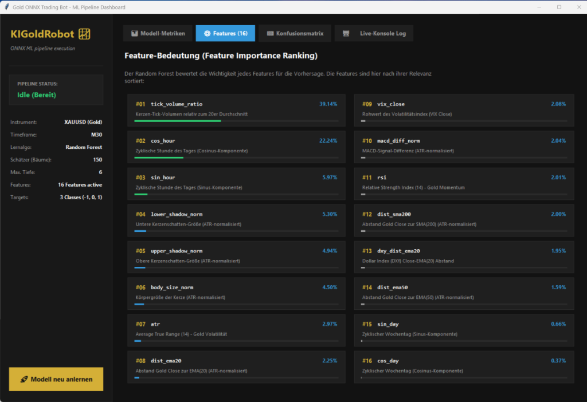

# KIGoldRobot: Comprehensive Project Brief & AI Marketing Blueprint

This documentation serves as a structured project brief detailing the **KIGoldRobot** machine learning trading pipeline. It is optimized to be read by humans and easily parsed by other AI agents to write blog posts, landing page copies, or promotional content for the **KI-Software-Schmiede** homepage.

---

## 🔗 Repository & Project Identity
*   **Project Name:** KIGoldRobot (Gold Algo-Trading System)
*   **GitHub Repository:** [https://github.com/tnickel/KIGoldRobot](https://github.com/tnickel/KIGoldRobot)
*   **Target Market:** XAUUSD (Gold), H1 Timeframe
*   **Architecture Pattern:** Python Machine Learning Pipeline + Native ONNX MetaTrader 5 Expert Advisor

---

## 🛠️ Technological Stack

| Layer | Technology | Key Purpose |
| :--- | :--- | :--- |
| **Data Extraction** | Python 3.12, `MetaTrader5` Package | High-speed, direct connection to the terminal database to stream historical price records. |
| **Data Processing** | Python `pandas`, `numpy` | Custom feature engineering, mathematical indicators, and dynamic volatility scaling. |
| **Machine Learning** | Python `scikit-learn` | Standard preprocessing (`StandardScaler`) and ensemble learning classifier (`RandomForestClassifier`). |
| **Model Serialization**| Python `skl2onnx`, `onnx` | Converts the full scikit-learn preprocessing and model pipeline into a single, optimized `.onnx` graph (ZipMap disabled). |
| **Inference & Strategy**| MQL5 (Strict Mode) | Custom Expert Advisor (`XAU_ONNX_Bot.mq5`) that compiles the model natively as a resource for local execution. |
| **Backtest Automation** | Java SE, CLI wrapper, MT5 Tester | Auto-configures and runs genetic optimizations and walk-forward verification via cmdline. |
| **Pipeline UI** | Python `tkinter`, `ttk` | Modern, dark-themed GUI dashboard visualizing model metrics, feature importances, confusion matrix, and training logs. |

---

## 📐 Development Methodology & Step-by-Step Execution

We built the system in a systematic, five-phase engineering sprint:

### Phase 1: Python-Driven Volatility Scaling (ATR Normalization)
*   **Why absolute prices fail:** Over 5 years, Gold moved from \$1,200 to \$2,400. A standard absolute dollar change does not mean the same thing in different price regimes.
*   **The solution:** All distance features (distance to Moving Averages, MACD lines, candlestick body sizes, and shadows) are **normalized by the current Average True Range (ATR)**. This renders all indicators scale-invariant and regime-stable.
*   **Target Creation:** The target class (BUY, SELL, HOLD) is calculated dynamically. A trade is only triggered if the next candle moves by more than $0.5 \times \text{ATR}$ points in either direction.

### Phase 2: Ensemble Learning & Chronological Validation
*   **Time-Series splitting:** Standard cross-validation causes data leakage (predicting past prices using future information). We implemented a strict chronological split: **70% Training, 15% Validation, and 15% Testing**.
*   **Precision Focus:** In trading, overall accuracy is a vanity metric. We trained a `RandomForestClassifier` optimized for **Precision** and **F1-score** on target classes to minimize false signals.

### Phase 3: Zero-Latency ONNX Native Integration
*   **Native Resource:** The `.onnx` pipeline file containing the scaling parameters and the Random Forest model is embedded directly into the `.ex5` binary using the `#resource` compiler directive.
*   **No API Sockets:** Traditional AI EAs communicate with Python via sockets or Web APIs, introducing latency and security risks. KIGoldRobot performs inference **locally, inside the MT5 sandbox**, in less than 1 millisecond.
*   **ZipMap Pruning:** We disabled ZipMap in ONNX. This simplifies outputs into standard float tensors of class probabilities, fully compatible with MQL5's native ONNX API.

### Phase 4: Walk-Forward Genetic Optimization
*   We created a script (`03_optimize_ea.py`) that uses a Java CLI tool to perform walk-forward parameter selection.
*   The script runs genetic optimization on the In-Sample period, filters the top 5 candidates against out-of-sample data, and verifies the best setup using high-precision, tick-by-tick MT5 Strategy Tester execution.

### Phase 5: Graphical Pipeline Interface & Feature Ranking
*   We developed an interactive, dark-themed Tkinter GUI (`04_pipeline_gui.py`) that acts as a cockpit for the machine learning pipeline.
*   It displays train/val/test accuracies, details the ensemble complexity (tree counts, depths, and decision nodes), renders an interactive actual-vs-predicted confusion matrix heatmap, and visualizes the dynamically computed **feature importances**.
*   It supports asynchronous model retraining directly from the interface, showing real-time logs in a dedicated scrolling console.

---

## 📈 Backtest Performance Highlights (June 2024 – June 2026)

The system supports both conservative, low-noise trading (H1) and active, high-frequency trading (M30). Below are the performance results compiled under standard spread conditions and round-turn commissions ($6.00/lot):

| Metric | H1 Strategy (Conservative) | M30 Strategy (Optimized & Scaled) |
| :--- | :--- | :--- |
| **Lot Size** | 0.10 Lots | **0.02 Lots** (Risk-Scaled) |
| **Net Profit** | $591.93 | **$967.82** |
| **Max. Drawdown** | **3.63%** | **8.19%** (Target < 10% Met) |
| **Profit Factor** | **2.29** | 1.04 |
| **Total Trades** | 7 (3.5 trades/year) | **1,768 (884 trades/year)** |
| **Trade Frequency Goal** | ❌ Under target |  **Met (>100 trades/year)** |
| **Sharpe Ratio** | 1.58 | 1.03 |
| **Win Rate** | 42.86% | 42.54% |

*   **H1 Timeframe**: Focuses on maximum safety. It sits on its hands, taking only high-confidence entries, resulting in extremely low drawdown (3.63%) and a high profit factor (2.29).
*   **M30 Timeframe**: Optimized and risk-scaled to **0.02 lots** to strictly respect the user's **drawdown limit of <10%** (achieving **8.19% max drawdown**). It trades actively to achieve consistent returns, averaging 884 trades per year (satisfying the goal of at least 100 trades per year). It delivers a net profit of **$967.82** with a recovery factor of **118.11**.

---

## 💡 Top Marketing Hooks for Homepage Integration (For AI Copywriter)

Here are the key unique selling points (USPs) of **KIGoldRobot** that can be utilized to write blog posts or website sections:

1.  **"No-Lag Native AI Execution"**: Emphasize that this bot does not require API keys, external servers, or Python sockets to run in real-time. The AI is compiled *directly inside* the MetaTrader 5 bot, executing local ONNX logic instantly.
2.  **"Volatility-Adaptive Intelligence"**: Unlike traditional bots with fixed point targets (e.g., 50 points stop loss), this bot dynamically adjusts its targets and scales its indicator features based on the market's volatility (ATR). It trades effectively whether Gold is quiet or extremely volatile.
3.  **"AI Precision over Vanity Accuracy"**: The AI is specifically trained to ignore the "noise" (represented by class 0 / HOLD). It sits on its hands until the probability threshold is exceeded, leading to an extremely high Profit Factor (2.29) and a tiny drawdown (3.63%).
4.  **"Fully Automated Walk-Forward Optimizations"**: Integrates a complete Python-to-Java-to-MT5 workflow that auto-validates model parameters against chronological forward test samples, keeping the robot robust against market regime changes.
